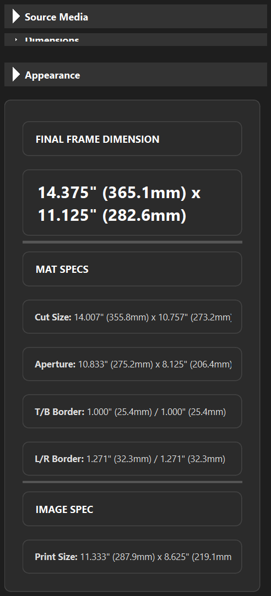

# FrameTamer Wiki

Welcome to the FrameTamer Wiki. This project is a professional utility for calculating picture frame and mat dimensions with pixel-perfect precision.

## Quick Start
1. **Load Media**: [Importing Photos & Textures](features/loading_media.md)
2. **Set Dimensions**: [Aperture & Profiles](features/dimensions.md)
3. **Configure Matting**: [Mounting & Borders](features/matting.md)
4. **Export Results**: [Blueprints & Images](features/exporting.md)

---

## The Core MetricCard
The heart of FrameTamer is the **MetricCard**. It provides a real-time, high-contrast breakdown of your final project dimensions.

## Sidebar Overview
All controls are grouped into collapsible sections for a clean, focused workflow.

