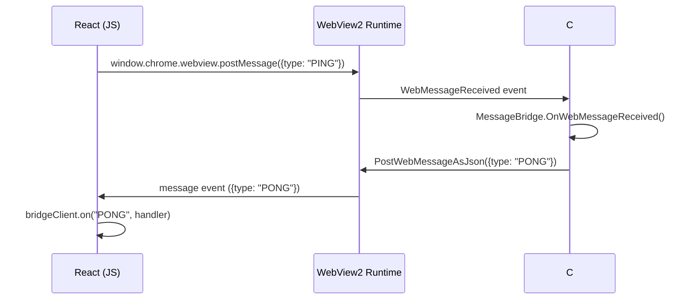

# Tech Spec: JSON Bridge Protocol

## 1. Objective
Define a robust, typed, bi-directional JSON messaging protocol between the C# SolidWorks Add-in backend (`SolidLink.Addin`) and the React/TypeScript frontend (`SolidLink.UI`). This spec establishes the message format, message types, and handler registrations required to enable **Stage-Based** state management as defined in the project's architecture.

---

## 2. System Boundaries

### Affected Modules
- **Backend:** `SolidLink.Addin.Bridge.MessageBridge`, `SolidLink.Addin.UI.SolidLinkWindow`
- **Frontend:** `SolidLink.UI/src/bridge/*` (new directory)

### API Entry Points
- **C# → JS:** `CoreWebView2.PostWebMessageAsJson(json)`
- **JS → C#:** `window.chrome.webview.postMessage(json)`

### External Dependencies
- `Newtonsoft.Json` (C# serialization)
- WebView2 Runtime (message transport)

---

## 3. Data Models / Schema

### 3.1. Message Envelope (Shared)
All messages MUST conform to this envelope structure:

```json
{
  "type": "string",
  "correlationId": "string | null",
  "payload": "object | null",
  "error": "string | null"
}
```

| Field | Type | Description |
|-------|------|-------------|
| `type` | `string` | Message type identifier (e.g., `PING`, `REQUEST_TREE`, `TREE_RESPONSE`). |
| `correlationId` | `string?` | UUID for request/response pairing. Auto-generated for requests; echoed in responses. |
| `payload` | `object?` | Type-specific data. |
| `error` | `string?` | Error message if the message represents a failure. Null on success. |

### 3.2. C# Class (Existing - Minor Update)
**`SolidLink.Addin.Bridge.BridgeMessage`**
- Add `Error` property:
```csharp
public string Error { get; set; }
```

### 3.3. TypeScript Interface (New)
**`SolidLink.UI/src/bridge/types.ts`**
```typescript
export interface BridgeMessage<T = unknown> {
  type: string;
  correlationId?: string;
  payload?: T;
  error?: string;
}
```

---

## 4. Message Types (Phase 1)

| Type | Direction | Payload | Description |
|------|-----------|---------|-------------|
| `PING` | JS → C# | `null` | Connection health check request. |
| `PONG` | C# → JS | `null` | Connection health check response. |
| `CONNECTION_STATUS` | C# → JS | `{ status: 'connected' }` | Sent after bridge initialization. |
| `REQUEST_TREE` | JS → C# | `null` | Request the SolidWorks assembly tree. |
| `TREE_RESPONSE` | C# → JS | `{ tree: ComponentNode[] }` | Assembly tree data. |
| `ERROR` | C# → JS | `{ code: string, message: string }` | Generic error broadcast. |

> [!NOTE]
> Future phases will add: `REQUEST_GEOMETRY`, `GEOMETRY_RESPONSE`, `JOINT_UPDATE`, `EXPORT_URDF`, etc.

---

## 5. Logical Flow



---

## 6. Implementation Requirements

### 6.1. Backend (C#)
1.  **Extend `BridgeMessage.cs`:** Add `Error` property.
2.  **Extend `MessageBridge.cs`:**
    -   Add typed handlers for `REQUEST_TREE`, `EXPORT_URDF`, etc.
    -   Implement `SendConnectionStatus()` to be called after `Initialize()`.
3.  **Update `SolidLinkWindow.xaml.cs`:**
    -   Call `bridge.SendConnectionStatus()` after WebView2 is ready.
    -   Route `REQUEST_TREE` to a future `TreeTraverser` service.

### 6.2. Frontend (TypeScript)
1.  **Create `src/bridge/` directory:**
    -   `types.ts`: `BridgeMessage` interface.
    -   `bridgeClient.ts`: Singleton client with `send()`, `request()`, and `on()` methods.
    -   `useBridge.ts`: React hook for component-level subscription.
2.  **Wire `App.tsx`:**
    -   Use `useBridge` hook to listen for `CONNECTION_STATUS`.
    -   Update `connectionStatus` state accordingly.

---

## 7. Security & Stability

| Risk | Mitigation |
|------|------------|
| **Thread Safety** | C# handler queues incoming messages to the STA thread using `Dispatcher.Invoke`. |
| **Message Flooding** | Implement a 100-message/second rate limit on the C# side. Log and drop excess. |
| **Deserialization Errors** | Wrap `JsonConvert.DeserializeObject` in try/catch; log malformed messages. |
| **Timeout Handling** | `SendRequestAsync` already implements a configurable timeout. |

---

## 8. Definition of Done (Architect)

- [x] Message envelope schema defined.
- [x] Phase 1 message types documented.
- [x] C# changes specified (`BridgeMessage.Error`, `SendConnectionStatus`).
- [x] Frontend bridge client architecture defined.
- [ ] **Implementation Pending (Developer):** Code changes per Section 6.
- [ ] **Verification Pending (Tester):** PING/PONG + CONNECTION_STATUS verified.
